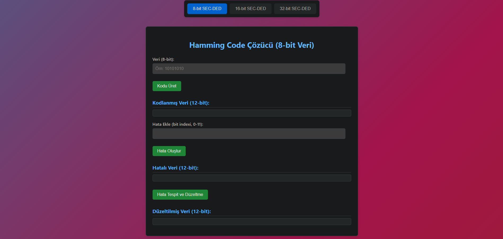

# 🛠️ Hamming SEC-DED Simülatörü

Bu proje, **Hamming kodlama** ile **SEC-DED** (Single Error Correction, Double Error Detection) mantığını temel alarak, kullanıcıların 8-bit veya 32-bitlik verilerdeki tek bitlik hataları tespit edip düzeltebildiği interaktif bir web uygulamasıdır.

---

## 🚀 Özellikler

- ✅ **8-bit, 16-bit ve 32-bit giriş desteği**
- 🔐 **Hamming kodu üretimi (SEC-DED yapısında)**
- 🧪 **Tek bitlik hata oluşturma ve simülasyon**
- 🔍 **Hata tespiti ve düzeltme işlemleri**
- 🖥️ **Kullanıcı dostu ve etkileşimli arayüz**

---

## 📷 Ekran Görüntüsü

> Arayüzü görmek için `index.html` dosyasını tarayıcınızda açabilirsiniz.



---

## 🎥 Demo Videosu

Projeyi çalışırken görmek istersen aşağıdaki bağlantıya tıklayarak demo videosunu izleyebilirsin:

📺 [YouTube&#39;da İzle](https://www.youtube.com/watch?v=72lL3q1FC24)

---

## 📄 Proje Raporu

Detaylı teknik açıklamalar, algoritma yapısı, hata düzeltme örnekleri ve kaynaklar için aşağıdaki rapora göz atabilirsin:

📘 [Proje Raporunu Görüntüle](https://github.com/ozay-mehmet/Haming-Code/blob/main/docs/BLM230_Proje_MehmetOzay_22360859062.pdf)

---

## 🧪 Nasıl Kullanılır?

1. `index.html` dosyasını çift tıklayarak tarayıcıda aç.
2. 8-bit, 16-bit veya 32-bitlik veri girişini yap.
3. **Kodu Üret** butonuna tıklayarak Hamming kodunu oluştur.
4. Hata eklemek istersen bir bit konumu gir ve **Hata Oluştur** butonuna tıkla.
5. **Hata Tespit Et** ya da **Hata Düzelt** seçeneklerinden birini kullanarak sonucu gözlemle.

---

## 📁 Dosya Yapısı

```
Hamming-Code/
│
├── index.html       # Ana kullanıcı arayüzü
├── style.css        # Arayüzün görsel stili
├── script.js        # Kodlama ve hata simülasyonu
└── assets/
    └── screenshot.png  # Ekran görüntüsü
    └── BLM230_Proje_MehmetOzay_22360859062.pdf  # Proje Raporu
```

---

## 💻 Yerel Kurulum

Projeyi kendi bilgisayarında çalıştırmak için:

```bash
git clone https://github.com/kullaniciAdi/Hamming-Code.git
cd Hamming-Code
start index.html
```

Alternatif olarak `index.html` dosyasını doğrudan tarayıcında açabilirsin.

---

## 🤝 Katkıda Bulunma

Projeyi beğendiyseniz ⭐ atarsanız çok memnun olurum :)

Her türlü katkı memnuniyetle karşılanır!

1. Fork'la ⭐
2. Yeni bir branch oluştur: `git checkout -b yenilik-ozelligi`
3. Değişikliklerini commit'le: `git commit -m 'Yeni özellik eklendi'`
4. Push et: `git push origin yenilik-ozelligi`
5. Pull request gönder ✨

> 📢 Büyük değişiklikler öncesinde bir issue açarak tartışma başlatman önerilir.

---

## 📬 İletişim

Her türlü soru, öneri veya geri bildirim için:
📧 `mehmetozay1204@gmail.com`
🌐 [LinkedIn Profilim](https://www.linkedin.com/in/mehmet-ozay/)
